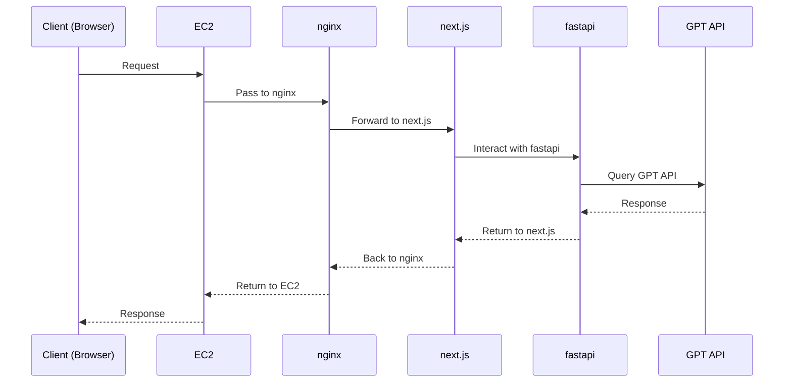
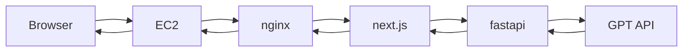

# mailgpt

sequenceDiagram

```mermaid
sequenceDiagram
    participant Client as Client (Browser)
    participant EC2 as EC2
    participant Docker1 as nginx
    participant Docker2 as next.js
    participant Docker3 as fastapi
    participant GPT as GPT API

    Client->>EC2: Request
    EC2->>Docker1: Pass to nginx
    Docker1->>Docker2: Forward to next.js
    Docker2->>Docker3: Interact with fastapi
    Docker3->>GPT: Query GPT API
    GPT-->>Docker3: Response
    Docker3-->>Docker2: Return to next.js
    Docker2-->>Docker1: Back to nginx
    Docker1-->>EC2: Return to EC2
    EC2-->>Client: Response
```

graph LR

```mermaid
graph LR

    Client[Browser] --> EC2[EC2]
    EC2 --> Docker1[nginx]
    Docker1 --> Docker2[next.js]
    Docker2 --> Docker3[fastapi]
    Docker3 --> GPT_API[GPT API]
    GPT_API --> Docker3
    Docker3 --> Docker2
    Docker2 --> Docker1
    Docker1 --> EC2
    EC2 --> Client[Browser]
```

