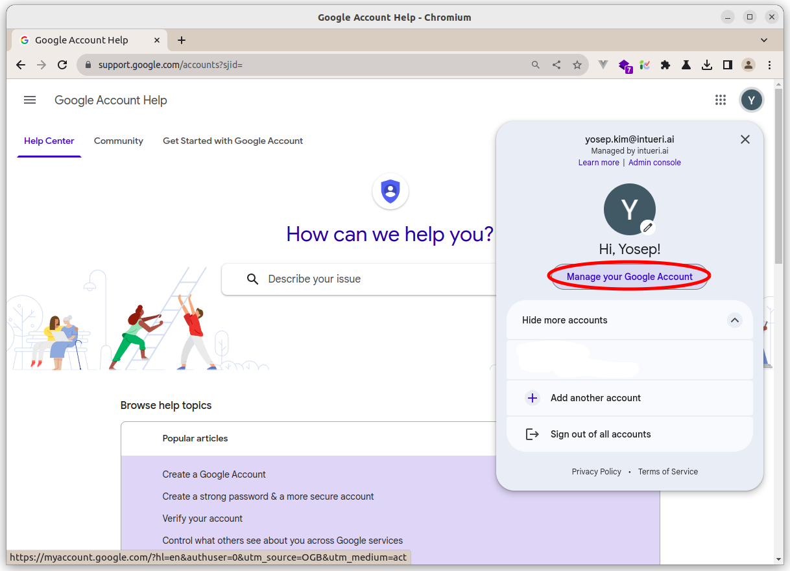
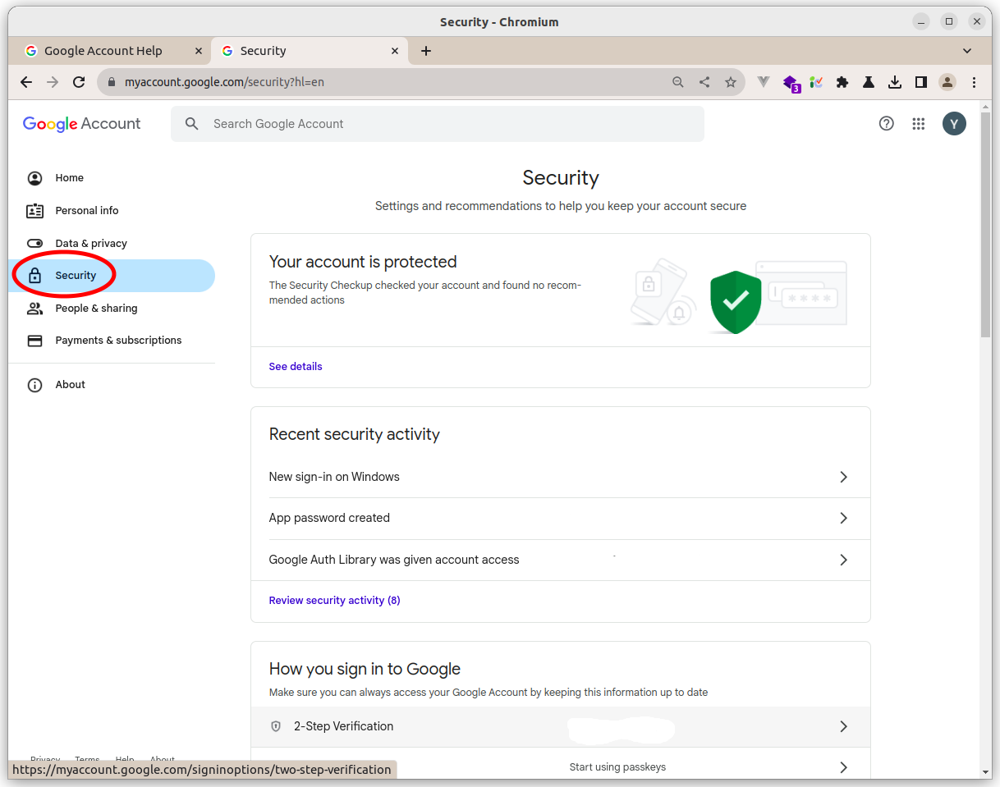
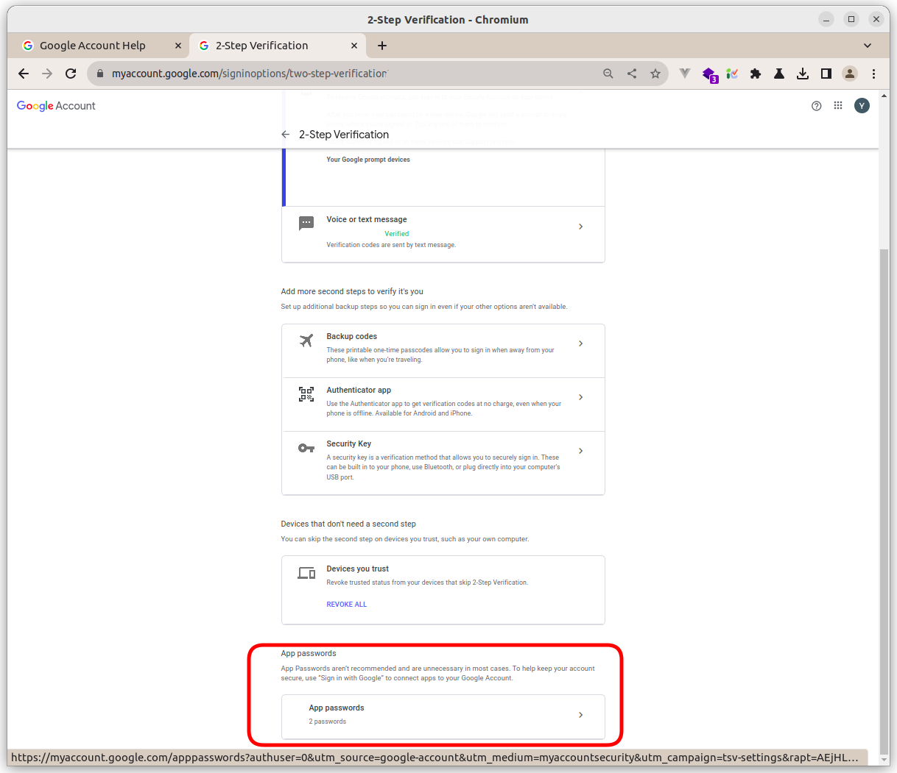
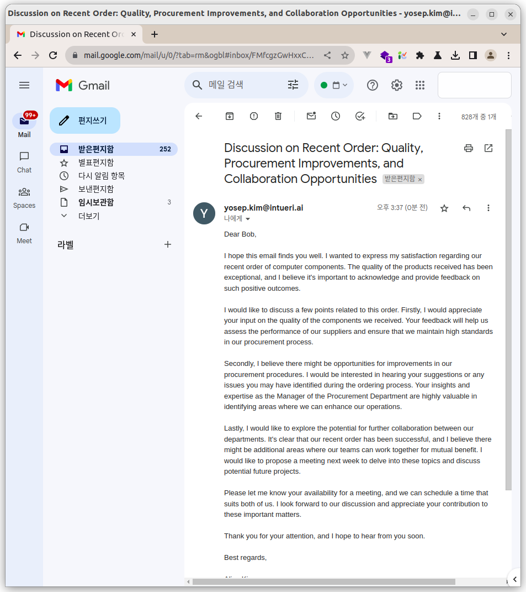
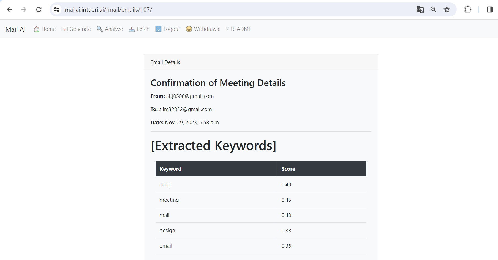

# SKKU Mail Project

## Table of Contents

### 1. [Project Overview](#project-overview)
### 2. [How to Use](#how-to-use)
   - [Home](#home)
   - [User Authentication](#user-authentication)
     - [Signup](#signup)
     - [SMTP Password](#smtp-password)
     - [Login](#login)
     - [Logout](#login)
     - [Withdrawal](#withdrawal)
   - [Generate](#generate)
     - [Generate Mail](#generate-mail)
     - [Send Mail](#send-mail)
   - [Fetch Mailbox](#fetch-mailbox)
   - [Analyze](#analyze)
     - [Email List](#email-list)
     - [Email Detail](#email-detail)
     - [Extract Keywords](#extract-keyword)
       - [KeyBERT](#keybert)
     - [Summarize](#summarize)
       - [BERT Summary](#bert-summarize)
       - [OpenAI Summary](#openai-summarize)
     - [Translate](#translate)
         - [Google Translator](#google-translator)
         - [OpenAI Translator](#openai-summarize)
### 3. [Architecture](#architecture)
  - [Database](#database)
  - [Web Application](#web-application)
  - [Infrastructure](#infrastructure)
### 4. [Project Structure](#project-structure)
### 5. [License](#license)
### 6. [Installation](#installation)
### 7. [Running the Project](#running-the-project)
### 8. [Contributing](#contributing)
## Project Overview

SKKU Mail is an AI-based email management system, developed as a capstone design project. It leverages Django, MariaDB, BERT, KeyBERT, Let's Encrypt, Docker, and other technologies, and is hosted on AWS EC2 with Route53. The system offers features like automatic mail generation, mail analysis, translation, and more, utilizing AI models including GPT and BERT.

## How to Use

### Home

- **Before Login:** View the home screen.
  
- **After Login:** Access the user-specific home screen.
  

### User Authentication

#### Signup

- Click the Signup button on the Navbar or Home.
  

#### SMTP Password

- To use SMTP and IMAP, follow these steps:
- Create an application password for SMTP and IMAP usage.
- For Naver and Google workspace, SMTP password is the same as IMAP password.
  
  
  
  

#### Login

- Login via the Home Page or Navbar.
  

#### Withdrawal

- Withdraw from the service via the Navbar.
- Confirm by typing your password.
  

### Generate Mail

- Fill the form to generate a mail.
- Example:
  - Name: Yosep Kim
  - Relation: CEO of our Company
  - Style: Formal
  - Text: To keep up with rapidly changing technology trends...
  
- A loading page appears during processing.
  

### Send Mail

- Preview your mail after a short wait due to API response limits.
  
- Modify if needed and send. A loading screen appears during sending.
  

### Fetch Mailbox

- Fetch emails by clicking the Fetch button in the navbar. This action doesn't affect the server's mailbox or read/unread status.
- Resetting affects only SKKU Mail's database.
  

### Analyze Email
- Language Limit: English (automated detection) 
- String Limit: 2048 (automated truncation)
- Token limit: 1024 (automated truncation)
#### Email List

- Accessible from Home Page or Navbar.

#### Email Detail

- Click an email to view details.
  

#### Extract Keywords with KeyBERT

- KeyBERT utilizes BERT for keyword extraction.
  

#### Summarize Email

- Summarize content using BERT or OpenAI's API.

##### BERT Summary

- Summarize using our cloud resources.
  

##### OpenAI Summary

- Summarize using OpenAI RESTful API.


#### Translate Email

- Choose between OpenAI-based or Google-based translation.

##### Google Translator

- Fast but less accurate.
  

##### OpenAI Translator

- Slower but more accurate.
  

## Architecture
### Database
#### ER Diagram

#### Session Management

#### Test DB Setup
- MariaDB Container Access
```bash
docker exec -it {container_id} mysql -u root -p
```

- Execute SQL
```sql
-- Grant privileges only for the test database
GRANT ALL PRIVILEGES ON `test\_%`.* TO 'mailai_user'@'%';
FLUSH PRIVILEGES;
```

- Check Privileges
```sql
SHOW GRANTS FOR 'mailai_user'@'%';
```

## Project Structure

```bash
skkumail/                      
├── build_docs.sh              – Auto-build & push Doxygen docs
├── commit.sh                  – Interactive git-commit helper
├── docker-compose.yaml        – MariaDB + Django + nginx-proxy stack
├── Doxyfile / docs/           – Doxygen config & generated site
├── Makefile                   – Convenience targets (build/up/down/logs/docs)
├── LICENSE                    – Apache-2.0
└── src/                       – Django monorepo
    ├── manage.py              – Django CLI entry
    ├── mailai/                – Core settings, URLs, ASGI/WSGI
    ├── authapp/               – Sign-up / login, SMTP-pwd encryption
    ├── wmailapp/              – “Write” : GPT-powered email composer & sender
    ├── rmailapp/              – “Read”  : IMAP fetcher, keyword/summary tools
    ├── comm/                  – Shared utils (GPT/BERT, IMAP/SMTP, crypto)
    ├── Dockerfile             – Runtime image (Ubuntu + Gunicorn + Uvicorn)
    └── entrypoint.sh          – Migrate DB then launch Gunicorn
```